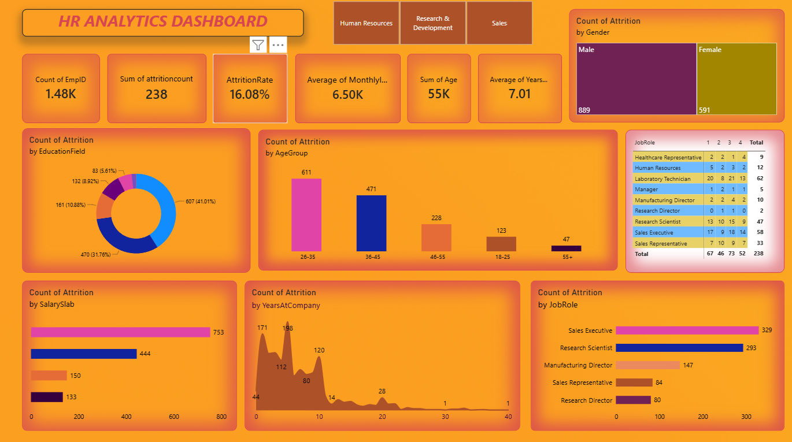

# 📊 HR Analytics Dashboard

An interactive **Power BI HR Analytics Dashboard** created to analyze employee attrition and workforce trends.

## 🛠️ Tools Used
- Power BI
- Excel / CSV
- Data Analysis
- Data Visualization

## 📌 Key Metrics
- Total Employees: **1.48K**
- Attrition Count: **238**
- Attrition Rate: **16.08%**
- Average Monthly Income: **6.50K**
- Average Years at Company: **7.01**

## 📈 Dashboard Insights
- Attrition by Gender
- Attrition by Age Group
- Attrition by Education Field
- Attrition by Salary Slab
- Attrition by Job Role
- Attrition by Years at Company

## 🖼️ Dashboard Preview

## 🎯 Objective
To transform HR data into interactive visual insights and understand employee attrition patterns using Power BI.
